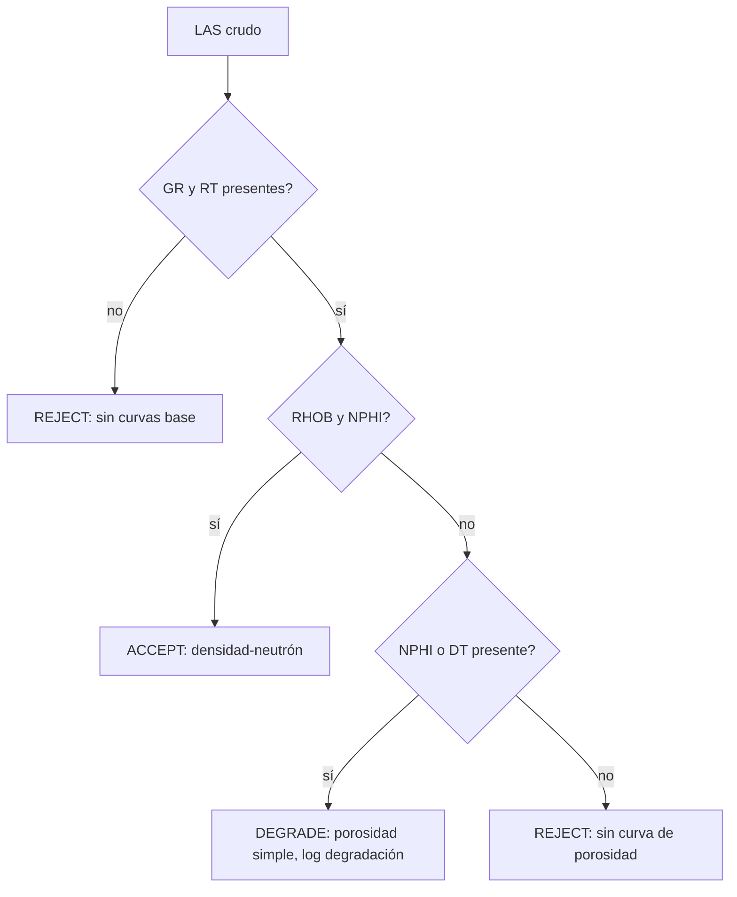

# Disponibilidad de curvas: registros vintage vs modernos

## Intuición

No todos los pozos traen las mismas curvas. La **época en que se perforó** determina
qué herramientas de registro existían y, por tanto, qué curvas hay en el LAS. Un pozo
de 1965 típicamente solo tiene **gamma ray (GR) + resistividad** (y a veces sónico);
un pozo de 2015 trae la **suite triple-combo completa** (GR, densidad `RHOB`, neutrón
`NPHI`, resistividad, sónico `DT`, fotoeléctrico `PEF`, caliper `CALI`).

Esto importa porque el método de porosidad que puedes usar **depende de las curvas
disponibles**, no de lo que tú quieras correr. Si el pozo no tiene `RHOB` ni `NPHI`,
no puedes calcular `PHIE` por densidad-neutrón — punto. El dato manda sobre el método.

## Las tres rutas de porosidad (y qué curva necesita cada una)

| Método de porosidad | Curva(s) requerida(s) | Disponible desde (aprox.)* |
|---|---|---|
| Sónico (Wyllie time-average) | `DT` (slowness) | registros acústicos tempranos |
| Neutrón | `NPHI` (o conteo de neutrón calibrado) | mediados del s. XX |
| Densidad–neutrón (crossplot) | `RHOB` **y** `NPHI` | herramientas de densidad más tardías |

\* Fechas exactas **por confirmar** contra una referencia primaria de historia del
*well logging*; el orden relativo (resistividad → GR → neutrón → densidad) es el dato
de dominio robusto. La fuente verificada directamente en este proyecto es el catálogo
de LAS del KGS (ver Aplicación).

**Implicación clave:** un pozo viejo con solo `GR + RT` no es "inútil" — tiene
porosidad si trae `DT` (sónico). Descartarlo por "no densidad-neutrón" es un criterio
demasiado estrecho.

## Formalismo (porosidad por densidad-neutrón)

$$\phi_D = \frac{\rho_{ma} - \rho_b}{\rho_{ma} - \rho_{fl}}, \qquad
\text{PHIE} = \frac{\phi_D + \phi_N}{2}$$

donde $\rho_b$ = `RHOB`, $\phi_N$ = `NPHI`. Sin $\rho_b$ no hay $\phi_D$, y el crossplot
colapsa a porosidad de una sola curva (neutron-only): $\text{PHIE} = \phi_N$.

## Flujo de decisión (intake según curvas)

## Contexto de dominio (campo Schaben, Kansas)

Inventariando los **161 pozos con LAS** del campo Schaben (de 353 totales), combinando
todas las corridas por pozo (join `KID = KGS_ID`):

- **28 ACCEPT** — modernos (2009–2024), suite densidad-neutrón completa.
- **61 DEGRADE** — vintage 1964–1998, típicamente `GR + NPHI + RT` (sin `RHOB`).
- **72 REJECT** — los más viejos (1952–1967), `GR + RT` (varios con `DT` sónico).

La lección: una muestra de 10 pozos sin agrupar corridas dio una imagen falsa
(parecía que Schaben "no tenía" densidad-neutrón). El inventario completo y honesto
mostró 28 pozos full-suite — suficientes para el método tal cual.

## Cómo se aplica en este proyecto

- La **compuerta de QC / intake** (Fase 1) clasifica cada pozo ACCEPT/DEGRADE/REJECT
  según sus curvas y **registra la degradación en el ledger** — nunca fabrica una
  curva faltante (`03_source_sink_contracts.md`, regla "no curve fabrication").
- `calc_phie` (Fase 0) tiene rutas de fallback density-only / neutron-only para los
  pozos DEGRADE.
- La selección del *working set* de Schaben parte de los 28 ACCEPT modernos.

## Autoevaluación

1. ¿Por qué un pozo de 1965 con `GR + RT + DT` NO debería marcarse REJECT?
2. Si falta `RHOB` pero hay `NPHI`, ¿qué porosidad puedes calcular y cómo se registra?
3. ¿Por qué inspeccionar **una** corrida por pozo subestima las curvas disponibles?

## Referencias

- Catálogo público de LAS del Kansas Geological Survey (Magellan Log Library +
  índice estatal `ks_las_files`) — **verificado directamente** en este proyecto.
- KGS Open-File Report OFR2000-79 (campo Schaben, workflow PfEFFER/Super-Pickett).
- Historia del *well logging* (orden de aparición de las herramientas) — **por
  confirmar** contra una referencia primaria antes de citar fechas exactas.
