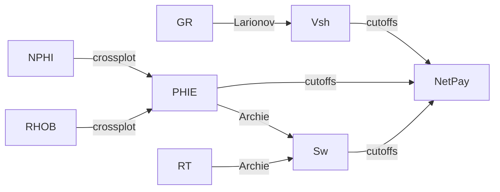

# Las tres ecuaciones core: Larionov, densidad-neutrón, Archie

## Intuición

La interpretación petrofísica básica responde tres preguntas, en cadena:
1. **¿Cuánta arcilla hay?** → `Vsh` (Larionov, desde el gamma ray).
2. **¿Cuánto espacio poroso útil?** → `PHIE` (densidad-neutrón).
3. **¿Cuánto de ese poro es agua (vs hidrocarburo)?** → `Sw` (Archie, desde resistividad).

Cada una es trivial de escribir pero fácil de equivocar en los detalles (variante,
clipping, dirección de monotonía). Por eso se **congelan + golden-testean**.

## Formalismo

**Vsh (Larionov rocas viejas / pre-Terciario):**
$$IGR = \frac{GR - GR_{min}}{GR_{max} - GR_{min}}, \quad
V_{sh} = 0.33\,(2^{2\,IGR} - 1)$$
(Terciario: $0.083\,(2^{3.7\,IGR}-1)$.) IGR se clipea a $[0,1]$.

**PHIE (densidad-neutrón):**
$$\phi_D = \frac{\rho_{ma}-\rho_b}{\rho_{ma}-\rho_{fl}}, \quad
\text{PHIE} = \frac{\phi_D + \phi_N}{2}$$

**Sw (Archie):**
$$S_w = \left(\frac{a\,R_w}{R_t\,\text{PHIE}^{m}}\right)^{1/n} \;\propto\; \text{PHIE}^{-m/n}$$

## El gotcha que costó un test (dirección de monotonía de Archie)

Como $S_w \propto \text{PHIE}^{-m/n}$ con $\text{PHIE}\in(0,1)$:
- **Sube PHIE → BAJA Sw** (a $R_t$ fijo). *No "más poro = más agua".*
- **Sube m → SUBE Sw** (no baja). Verificación: $a{=}1,R_w{=}0.05,R_t{=}10,\phi{=}0.2,n{=}2$
  → $m{=}1.5\Rightarrow S_w{=}0.236$; $m{=}2.5\Rightarrow S_w{=}0.529$.

El blueprint tenía ambas direcciones invertidas; se detectó **solo al implementar y
testear** (ver `planning/DECISIONS.md` D1). Lección: la consistencia textual de un spec
no garantiza corrección física — el golden test es la red.

## Flujo

## Cómo se aplica

- `src/petrophysics/vsh.py` · `phie.py` · `sw.py` — funciones congeladas v0.1.0.
- `netpay.py` / `volumetrics.py` — agregaciones (net sand/reservoir/pay, HCPV/BVW) sobre
  esas tres salidas; no son ecuaciones nuevas.
- Golden tests en `tests/test_{vsh,phie,sw,netpay,volumetrics}.py` (46 tests).

## Autoevaluación

1. Para PHIE<1 fija, si duplicas `m`, ¿Sw sube o baja? ¿Por qué?
2. ¿Por qué se clipea IGR a [0,1] *antes* de aplicar Larionov?
3. Si falta RHOB pero hay NPHI, ¿qué PHIE calculas y cómo lo registras?

## Referencias

- Archie, G.E. (1942) — ecuación de saturación. (por confirmar edición/página)
- Larionov, V.V. (1969) — corrección Vsh rocas viejas. (por confirmar)
- Funciones y tests verificados directamente en este repo (`src/petrophysics/`).
