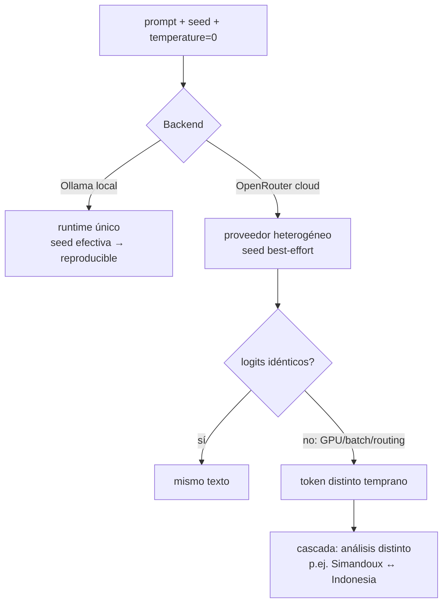

# Seed de decodificación en LLMs: determinismo local vs best-effort en cloud

> **Dominio**: ML / software
> **Prerrequisitos**: [[02_ecuaciones_core_petrofisica]] (para entender qué decide el agente)
> **Dificultad**: intermedio

## Intuición

Un LLM no "escribe" texto: en cada paso produce una distribución de probabilidad
sobre el siguiente token y **muestrea** de ella. La `seed` inicializa el generador
de números aleatorios de ese muestreo — misma seed + misma distribución = misma
secuencia de tokens. Es el mismo concepto que `np.random.default_rng(seed)` en el
motor Monte Carlo, aplicado a la generación de texto.

La trampa: la seed solo congela el **muestreo**. Si la distribución subyacente
cambia entre llamadas (otro hardware, otro batch de inferencia, kernels no
deterministas en GPU, otro proveedor detrás del mismo endpoint), la misma seed
produce texto distinto. Por eso en local (Ollama, un solo runtime) la seed es
efectiva, y en cloud (OpenRouter enruta a proveedores heterogéneos) es
**best-effort**: se envía, pero nadie garantiza la reproducibilidad.

Con `temperature=0` el muestreo se vuelve greedy (argmax) y la seed casi no
interviene — pero los empates de punto flotante y el no-determinismo de GPU
siguen pudiendo flipear un token, y un token distinto temprano cambia todo lo
que sigue (efecto cascada).

## Formalismo

En cada paso $t$ el modelo computa logits $z_t \in \mathbb{R}^{|V|}$ sobre el
vocabulario $V$ y muestrea:

$$ P(x_t = i \mid x_{<t}) = \frac{e^{z_{t,i}/T}}{\sum_{j} e^{z_{t,j}/T}} $$

- $T$ (`temperature`): escala los logits. $T \to 0$ colapsa a
  $\arg\max_i z_{t,i}$ (greedy); $T=1$ muestrea la distribución tal cual.
- La `seed` fija el estado del RNG que resuelve el muestreo (y los empates).
- El no-determinismo residual viene de que $z_t$ mismo puede variar:
  reducciones en paralelo en GPU no son asociativas en punto flotante
  ($ (a+b)+c \neq a+(b+c) $), así que el mismo prompt puede dar logits que
  difieren en el último bit — suficiente para flipear un argmax casi empatado.

## Flujo / mecanismo

## Contexto de dominio

En este proyecto el LLM no calcula: **elige** (método de Sw, pozos, zona). El
no-determinismo del texto se convierte entonces en no-determinismo de
*decisiones interpretativas* — exactamente lo que el experimento
`v7_random_seed` (2026-07-02) midió: ¿la seed determina el informe, o el modelo
está orientado a su análisis?

Resultado (seed 42 vs seeds 13/101/777/2025, motor pineado):

| Modelo | Selección de pozos | Método Sw (pozos compartidos) | Net pay |
|---|---|---|---|
| gpt-5 | idéntica | flipea 3/4 (Simandoux↔Indonesia) | ±5-8% |
| opus-4.8 | idéntica | flipea 2/4 | −22% en un pozo |
| deepseek-r1 | varía (+1 pozo) | 3/3 idéntico | bit-idéntico |
| qwen3-max | idéntica | 4/4 idéntico | bit-idéntico |

Lectura: la **identidad analítica es del modelo, no de la seed** (cuaterna de
pozos propia, perfil de conducta, siempre familia shaly-sand, 1 elección
interpretativa, 0 opcionales). La seed solo mueve la elección *dentro* de la
familia en los modelos menos deterministas — y donde la elección se repite, el
número es bit-idéntico porque lo produce el motor determinista, no el LLM.

## Cómo se aplica en este proyecto

- `Aplicado en: src/agents/client.py:35` — `make_chat(model, seed=42)`: la seed
  se pinea en ambos backends; el docstring de `_make_openrouter_chat` documenta
  el contrato best-effort en cloud.
- `Aplicado en: src/uncertainty/montecarlo.py:78` — el motor usa su propia seed
  (42) + `multi_seed_robustness` con `(1, 7, 42, 99)`: el camino cuantitativo es
  reproducible **por construcción**, independiente del LLM.
- `Aplicado en: debug/gen_field_report_v7_random_seed.py` — el experimento: una
  seed distinta por modelo, motor pineado, para aislar seed vs orientación.

## Por qué esto y no la alternativa

Alternativa considerada: variar también la seed del motor Monte Carlo. Rechazada
— habría mezclado dos fuentes de variación (elecciones del agente + muestreo del
MC) y el delta ya no aislaría nada. Variar UN factor por experimento; el motor
pineado convierte cualquier delta numérico en evidencia de una *decisión*
distinta del agente.

## Autoevaluación

1. ¿Por qué `temperature=0` no garantiza texto idéntico entre dos llamadas al
   mismo endpoint cloud?
2. Si dos corridas con seeds distintas dan net pay bit-idéntico en un pozo,
   ¿qué concluyes sobre las elecciones del agente en ese pozo?
3. ¿Por qué el experimento mantiene pineada la seed del Monte Carlo mientras
   varía la del LLM?

## Referencias

- OpenRouter — documentación de parámetros de la API (`seed`: "If specified,
  the inferencing will sample deterministically… determinism is not guaranteed
  for some models"): <https://openrouter.ai/docs>
- > [referencia por confirmar: paper/post técnico sobre no-determinismo de
  > inferencia LLM en GPU (reducciones de punto flotante no asociativas y
  > variación batch-dependent)]
