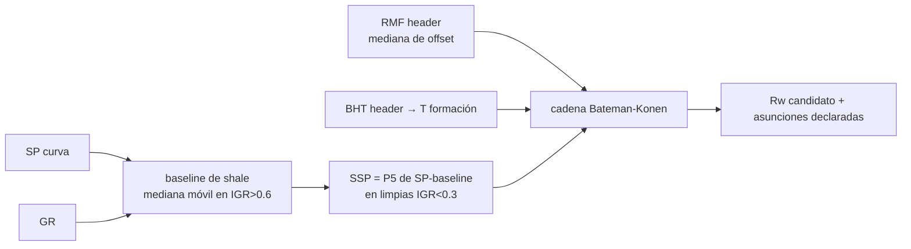

# SP estático (SSP) → Rw: la resistividad del agua desde el potencial espontáneo

> **Dominio**: petróleo / petrofísica
> **Prerrequisitos**: [[02_ecuaciones_core_petrofisica]]
> **Dificultad**: intermedio

## Intuición

La curva SP mide un voltaje natural entre el lodo del pozo y el agua de formación:
cuando sus salinidades difieren, los iones migran y generan una deflexión frente a las
capas permeables limpias. Cuanto más salada el agua de formación respecto al filtrado
de lodo, más negativa la deflexión. Leída con cuidado, esa deflexión es un **medidor
gratuito de Rw** — el parámetro que domina la incertidumbre de Archie cuando no hay
muestras de agua producida.

Dos obstáculos prácticos: (1) la línea base de shale deriva a lo largo del pozo (hay
que restarla, no asumirla horizontal); (2) el SP solo es legible si existen poblaciones
claras de shale y de roca limpia para anclar la deflexión.

## Matemática

$$SSP = -K \cdot \log_{10}\!\left(\frac{R_{mfe}}{R_{we}}\right), \qquad K = 61 + 0.133\,T(^{\circ}F)$$

Cadena de conversión (Bateman–Konen):

1. $R_{mfe} \approx 0.85 \cdot R_{mf}$ (lodos predominantemente NaCl).
2. $R_{we} = R_{mfe} \cdot 10^{\,SSP/K}$.
3. $R_{we} \to R_w$ (ajuste de carta, a temperatura de formación):
   - si $R_{we} > 0.12$: $R_w = -(0.58 - 10^{\,0.69 R_{we} - 0.24})$
   - si no: $R_w = \dfrac{77\,R_{we} + 5}{146 - 377\,R_{we}}$

## Flujo en el motor

## Contexto de dominio (Schaben)

Los pozos clase-A tienen SP+GR pero sus headers no traen RMF/BHT; los vintage traen
RMF/BHT pero no GR canónico. La solución honesta: RMF = mediana de los headers de
offset (asunción cross-well DECLARADA en la evidencia). Resultado de campo: 38/38 SSP
legibles, banda Rw = 0.041–0.054 ohm·m — **confirmación independiente del default
regional 0.04** que hasta entonces era solo una asunción.

## Cómo se aplica aquí

- Función vetada: `src/petrophysics/sp_rw.py` (`sp_ssp`, `rw_from_ssp`) con golden
  tests (`tests/test_sp_rw_mhi.py`: K exacto, ramas de conversión, monotonía SSP↓→Rw↓).
- Evidencia para el agente: observación `rw_evidence` (`src/agents/loop_actions.py`).
- En el summit v3 la banda parametrizó el rango Rw del Monte Carlo con provenance
  registrado (`mc_ranges_override`).

## Por qué esto y no la alternativa

La alternativa a Rw-desde-SP es el catálogo de aguas producidas (no disponible para
estas leases) o el Rwa por zona limpia (circular: depende de la porosidad calculada).
El SP es la única medición independiente presente en los LAS — con la asunción de RMF
de offset declarada, es evidencia; sin declararla, sería contaminación.

## Autoevaluación

1. ¿Por qué la deflexión SP es negativa cuando el agua de formación es más salada que
   el filtrado? 2. ¿Qué rompe la lectura del SSP si la línea base de shale deriva y no
   se corrige? 3. ¿Por qué la mediana de RMF de pozos vecinos es una asunción aceptable
   si se declara — y qué la invalidaría?

## Referencias

- Bateman, R. y Konen, C., "The Log Analyst and the Programmable Pocket Calculator",
  The Log Analyst (SPWLA), 1977 — fuente clásica de la cadena Rwe→Rw (edición exacta
  por confirmar).
- Asquith, G. y Krygowski, D., *Basic Well Log Analysis*, AAPG Methods in Exploration
  16 — capítulo de SP (por confirmar página).
