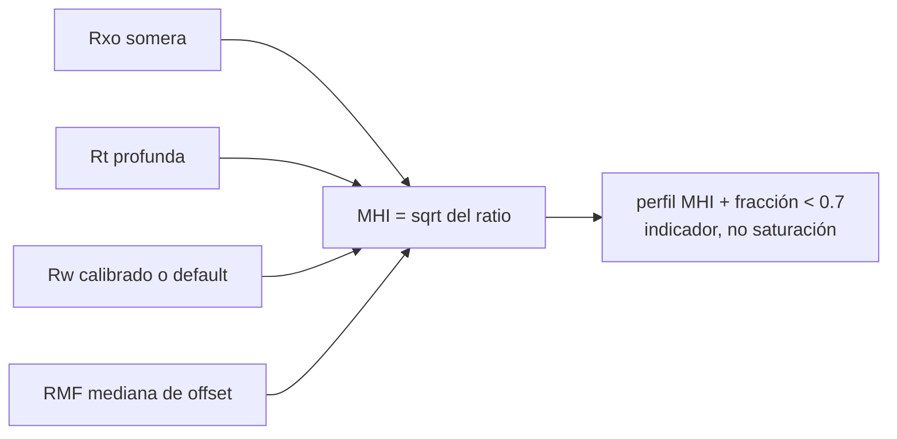

# MHI (movable hydrocarbon index): hidrocarburo móvil desde el contraste Rxo/Rt

## Intuición

Cuando se perfora, el filtrado de lodo invade la zona cercana al pozo y desplaza los
fluidos móviles. Si había hidrocarburo móvil, la zona lavada (que lee la herramienta
somera, Rxo) queda con más agua que la zona virgen (que lee la profunda, Rt) — y ese
contraste eléctrico delata el movimiento. Si nada se movió (agua, o hidrocarburo
residual), las dos leen proporciones parecidas. El MHI convierte ese contraste en un
indicador: **no mide cuánto hidrocarburo hay, mide si se mueve**.

## Matemática

Con Archie en ambas zonas (mismo factor de formación $F$):

$$S_w^2 = \frac{F \cdot R_w}{R_t}, \qquad S_{xo}^2 = \frac{F \cdot R_{mf}}{R_{xo}}$$

$$MHI = \frac{S_w}{S_{xo}} = \sqrt{\frac{R_{xo}/R_t}{R_{mf}/R_w}}$$

Lectura: $MHI \lesssim 0.7$ sugiere hidrocarburo móvil; $MHI \approx 1$ = sin
movimiento (agua o residual). $F$ se cancela — por eso el método no necesita porosidad.

## Flujo

## Contexto de dominio (Schaben)

70 pozos tienen RXO+RT solapados; algunos vintage traen incluso la curva de servicio
RXORT (el ratio ya computado por la compañía de registro — sirve de cross-check). En el
pozo 24,881 el MHI mediano dio 0.597 (< 0.7): indicación de móvil en el bloque
consolidado — un hallazgo que ninguna curva individual muestra por sí sola.

## Cómo se aplica aquí

- Función vetada: `movable_hydrocarbon_index` en `src/petrophysics/sw.py`, golden tests
  en `tests/test_sp_rw_mhi.py` (caso analítico MHI=0.7 exacto, NaN policy, params>0).
- Evidencia para el agente: observación `mhi_scan` (`src/agents/loop_actions.py`) — el
  Rmf viene de la mediana de offset con asunción declarada.
- En el summit v3 aparece como evidencia en prosa con sus asunciones; la nota clave del
  contrato: es un **perfil indicador, nunca una saturación**.

## Autoevaluación

1. ¿Por qué se cancela el factor de formación y qué ventaja práctica da eso?
2. ¿Qué pasa con el MHI en una caliza apretada sin invasión — y por qué eso NO
   significa hidrocarburo móvil? 3. ¿Por qué el proyecto lo reporta como indicador y se
   prohíbe usarlo como Sw?

## Referencias

- Asquith, G. y Krygowski, D., *Basic Well Log Analysis*, AAPG Methods in Exploration
  16 — método ratio y umbral 0.7 (por confirmar página).
- Schlumberger, *Log Interpretation Principles/Applications* — zonas de invasión y
  Rxo/Rt (por confirmar edición).
