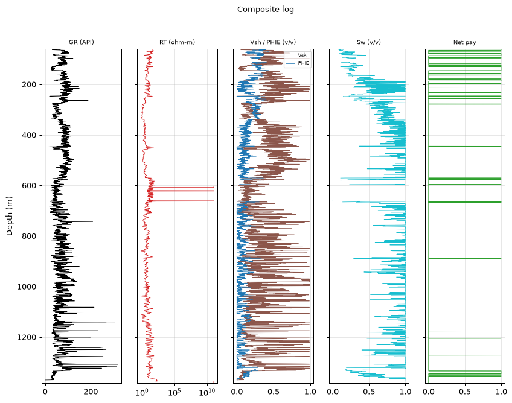
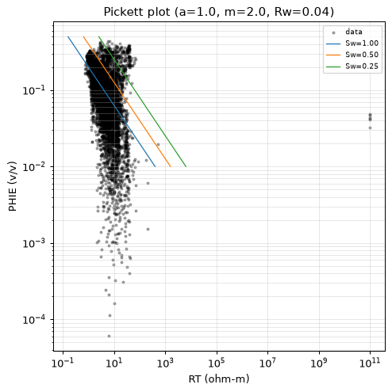
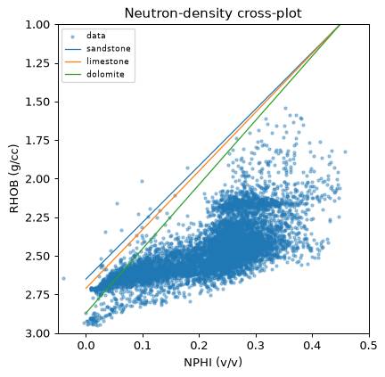

# Petrophysical Interpretation Report — 15-135-24,881-00-00

| | |
|---|---|
| **Well (UWI)** | 15-135-24,881-00-00 |
| **Larionov variant** | old_rocks (degraded) |
| **Convergence status** | DID_NOT_CONVERGE |
| **Confidence tier** | ○ BRACKETED |
| **Engine versions** | calc_vsh 0.1.0 · calc_phie 0.1.0 · calc_sw 0.1.0 |
| **Config hash (SHA-256)** | `2a9cb78728e386ab…` |
| **Git SHA** | `26ac83a578c1` |
| **Generated** | autonomously, no human in the per-report loop |


---

> **Confidence legend.** Each result is tagged by parameter provenance: **● FIRM** (core-calibrated) · **◐ QUALIFIED** (offset-derived) · **○ BRACKETED** (regional/global default — read as a range, dominant uncertainty stated). The system does not claim *always correct*; it states how well-supported each number is.


---

## 1. Executive summary

> ⚠️ **ABSTENTION — this is NOT a confident estimate.** The run did not converge to a defensible result; the numbers below are an uncalibrated engineering estimate, reported for transparency only:
> - 1 unresolved MECHANICAL objection(s)

The well's gross interval spans an impressive 1323.1 meters, but its net-to-gross ratio of 0.054 suggests that only a small fraction of this rock is actually productive. The dominant uncertainty parameter, Rw, introduces significant variability in our estimates, with a swing of 70.6 meters indicating the potential for substantial differences in net pay.

We can bracket the average porosity at around 24.2%, based on the P10/P50/P90 values of 0.242/0.243/0.244. Water saturation is estimated to be approximately 30.4% (P10/P50/P90: 0.304/0.305/0.306). Shale volume, a critical component in our analysis, is pegged at around 14.9% (P10/P50/P90: 0.149/0.150/0.151).

The net-pay estimates are similarly bracketed, with P10/P50/P90 values of 49.1/71.2/126.2 meters. However, it's essential to note that these results are heavily influenced by the regional DEFAULT for Rw, which introduces a significant degree of uncertainty.

Given the unresolved MECHANICAL objection and the high-leverage warning regarding Rw, we must approach this analysis with caution. The result is not a confident point estimate but rather a range of possibilities, bounded by the limitations imposed by the dominant uncertainty parameter.

> **Net pay P10 / P50 / P90 = 49.1 / 71.2 / 126.2 m.**
> Net pay is dominated by 'Rw', which is a regional DEFAULT (uncalibrated). This is the single largest uncertainty — the result is bracketed, not a confident point estimate.


---

## 2. Methodology

All numbers are produced by the deterministic, golden-tested engine. The LLM only selects methods/parameters and writes prose — it never computes a number.

| Step | Method (frozen) | Version |
|---|---|---|
| Vsh | Larionov old rocks (Paleozoic) from GR | `calc_vsh 0.1.0` |
| PHIE | Density–neutron crossplot (neutron-only fallback) | `calc_phie 0.1.0` |
| Sw | Archie | `calc_sw 0.1.0` |
| Net pay | Vsh/PHIE/Sw cutoffs → net sand → net reservoir → net pay | `netpay 0.1.0` |
| Uncertainty | Monte Carlo P10/P50/P90 + parameter sensitivity | `mc 0.1.0` |


---

## 3. Parameters and provenance

| Parameter | Value | Unit | Provenance | Source |
|---|---|---|---|---|
| gr_min | 20.000 | API | default | — |
| gr_max | 120.000 | API | default | — |
| rho_ma | 2.700 | g/cc | data_driven | Schlumberger 1989 |
| rho_fl | 1.000 | g/cc | default | — |
| phie_max | 0.450 | v/v | default | — |
| phi_sh_d | 0.151 | v/v | data_driven | — |
| phi_sh_n | 0.276 | v/v | data_driven | — |
| a | 1.000 | - | default | Winsauer et al. 1952 |
| m | 2.000 | - | default | Archie, G.E. 1942 |
| n | 2.000 | - | default | Archie, G.E. 1942 |
| Rw | 0.040 | ohm-m | default | Kansas Geological Survey 2000 |
| rt_hydrocarbon_floor | 5.000 | ohm-m | default | — |
| vsh_cutoff | 0.350 | v/v | default | — |
| phie_cutoff | 0.100 | v/v | default | — |
| sw_cutoff | 0.500 | v/v | default | — |
| bit_size_config | 7.875 | in | default | — |
| qc_abort_threshold | 0.800 | - | default | — |
| circuit_breaker_n | 3.000 | - | default | — |

> The citations table (not RAG) gives each cited parameter exactly one frozen source. Parameters tagged `default` are regional/global — they drive the bracketed tier.


---

## 4. Zonation (net-pay intervals)

Raw net-pay runs merged into 34 intervals (gap tolerance 1.5 m); showing the 15 thickest, depth-ordered. Full set traces in the ledger.

| Interval | Top (m) | Base (m) | Net pay (m) | Avg PHIE | Avg Sw | Avg Vsh |
|---|---|---|---|---|---|---|
| Z1 | 59.4 | 64.9 | 5.2 | 0.300 | 0.112 | 0.183 |
| Z2 | 67.4 | 69.0 | 0.8 | 0.265 | 0.166 | 0.338 |
| Z3 | 80.3 | 85.8 | 5.6 | 0.303 | 0.285 | 0.140 |
| Z4 | 93.6 | 96.2 | 1.7 | 0.274 | 0.244 | 0.269 |
| Z5 | 116.6 | 117.7 | 1.2 | 0.274 | 0.290 | 0.246 |
| Z6 | 122.2 | 145.2 | 21.8 | 0.295 | 0.265 | 0.109 |
| Z7 | 162.9 | 164.1 | 1.4 | 0.239 | 0.380 | 0.254 |
| Z8 | 181.7 | 186.5 | 5.0 | 0.211 | 0.383 | 0.172 |
| Z9 | 194.6 | 195.1 | 0.6 | 0.209 | 0.428 | 0.322 |
| Z10 | 248.0 | 248.4 | 0.6 | 0.271 | 0.173 | 0.059 |
| Z11 | 570.4 | 570.9 | 0.6 | 0.287 | 0.172 | 0.231 |
| Z12 | 663.9 | 665.7 | 0.9 | 0.193 | 0.288 | 0.320 |
| Z13 | 889.3 | 890.2 | 1.1 | 0.278 | 0.352 | 0.235 |
| Z14 | 1333.5 | 1346.6 | 12.6 | 0.147 | 0.360 | 0.105 |
| Z15 | 1352.1 | 1356.7 | 4.6 | 0.160 | 0.421 | 0.066 |

---

## 5. Results

| Quantity | Value |
|---|---|
| Gross interval | 1323.1 m |
| Net pay (P10/P50/P90) | 49.1 / 71.2 / 126.2 m |
| Net-to-gross | 0.054 |
| Avg PHIE (net pay) | 0.242 |
| Avg Sw (net pay) | 0.304 |
| Avg Vsh (net pay) | 0.149 |


---

## 6. Uncertainty and sensitivity

Monte Carlo, 500 realizations (seed 42). Net pay swing per parameter (one-at-a-time):

| Parameter | Net-pay swing (m) |
|---|---|
| Rw | 70.6 |
| m | 41.3 |
| a | 28.5 |
| n | 8.4 |

**Dominant uncertainty: `Rw`** (swing 70.6 m).

> Net pay is dominated by 'Rw', which is a regional DEFAULT (uncalibrated). This is the single largest uncertainty — the result is bracketed, not a confident point estimate.

---

## 7. Data quality and validator objections

QC edits applied before compute — degradation: 2, range_warn: 4, spike_removal: 134, unit_conversion: 1.

| Validator | Type | Detail |
|---|---|---|
| vsh_phie_anticorrelation | support | Vsh-PHIE Pearson 0.99 > 0.3 (dirty rock + high porosity) |
| rt_sw_consistency | mechanical | 63 depths with Sw<0.4 but RT<5.0 ohm-m |

---

## 8. Conclusions

The well's net pay is bracketed due to the dominant influence of Rw, a regional DEFAULT value that has not been calibrated for this specific location. The P10/P50/P90 estimates range from 49.1 to 126.2 meters, indicating significant uncertainty in the net-pay calculation. Given the high-leverage warning and unresolved MECHANICAL objection(s), it is essential to revisit Rw's calibration and consider acquiring more localized data to refine its value.

---

## 9. Figures

**Composite log**



**Pickett plot**



**Neutron-density crossplot**




---

## Appendix A — Ledger excerpt (traceability)

```json
{
  "net_pay_total_m": 71.17080000000004,
  "net_pay_p10_p50_p90": [
    49.07280000000003,
    71.24700000000004,
    126.21768000000009
  ],
  "driving_params": {
    "a": 1.0,
    "m": 2.0,
    "n": 2.0,
    "Rw": 0.04
  },
  "claim_verifier": {
    "result": "FLAGS",
    "flags": [
      24.2,
      30.4
    ]
  }
}
```


---

## Appendix B — Completeness gate

| Item | Present |
|---|---|
| QC edits recorded before compute | ✓ |
| Every number ledger-traced | ✓ |
| Confidence tier on the run | ✓ |
| Parameter citations frozen | ✓ |
| Validator objections listed, not hidden | ✓ |
| Uncertainty propagated (Monte Carlo) | ✓ |
| Claim verifier run on prose | ✓ |
