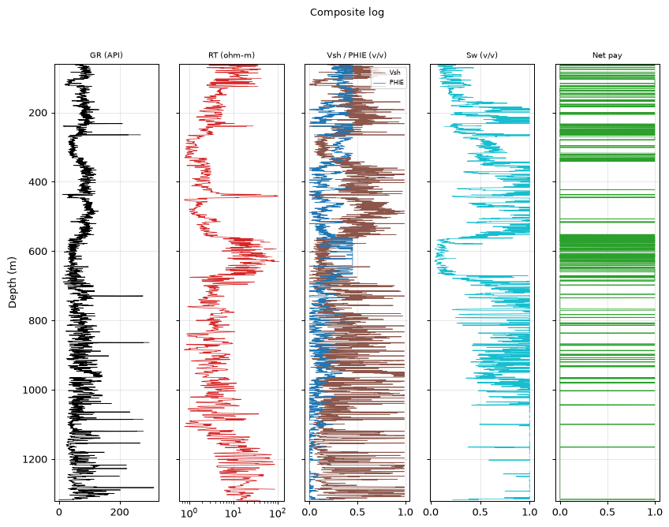
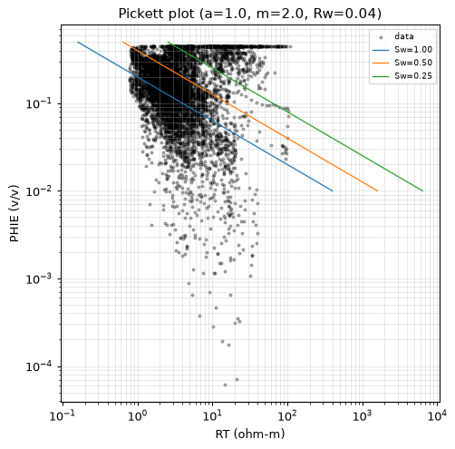
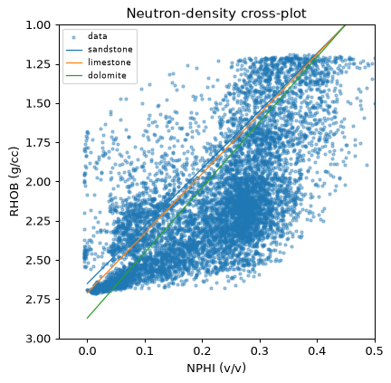

# Petrophysical Interpretation Report — 15-135-24,938-00-00

| | |
|---|---|
| **Well (UWI)** | 15-135-24,938-00-00 |
| **Log date** | Sat Oct 24 20-24-33 2009 |
| **Service company** | Log Tech |
| **Larionov variant** | old_rocks (degraded) |
| **Convergence status** | DID_NOT_CONVERGE |
| **Confidence tier** | ○ BRACKETED |
| **Engine versions** | calc_vsh 0.1.0 · calc_phie 0.1.0 · calc_sw 0.1.0 |
| **Config hash (SHA-256)** | `2a9cb78728e386ab…` |
| **Git SHA** | `dfc9ed8176b7` |
| **Generated** | autonomously, no human in the per-report loop |


---

> **Confidence legend.** Each result is tagged by parameter provenance: **● FIRM** (core-calibrated) · **◐ QUALIFIED** (offset-derived) · **○ BRACKETED** (regional/global default — read as a range, dominant uncertainty stated). The system does not claim *always correct*; it states how well-supported each number is.


---

## 1. Executive summary

> ⚠️ **ABSTENTION — this is NOT a confident estimate.** The run did not converge to a defensible result; the numbers below are an uncalibrated engineering estimate, reported for transparency only:
> - 1 unresolved MECHANICAL objection(s)
> - net-pay avg PHIE 0.35 > 0.25 — implausibly high for carbonate

The well's gross interval spans a considerable 1262 meters, but only about 18% of this length is considered net pay based on the calculated net-to-gross ratio. The average effective porosity within these net-pay zones is bracketed at around 0.35, which seems implausibly high for a carbonate reservoir - typically, such formations exhibit lower porosities. Water saturation averages approximately 0.26, leaving about 74% of pore space occupied by hydrocarbons. However, the dominant uncertainty parameter, Rw, introduces significant variability, with its uncalibrated regional DEFAULT value contributing to the overall bracketed nature of these estimates.

> **Net pay P10 / P50 / P90 = 135.7 / 179.0 / 284.9 m.**
> Net pay is dominated by 'Rw', which is a regional DEFAULT (uncalibrated). This is the single largest uncertainty — the result is bracketed, not a confident point estimate.


---

## 2. Methodology

All numbers are produced by the deterministic, golden-tested engine. The LLM only selects methods/parameters and writes prose — it never computes a number.

| Step | Method (frozen) | Version |
|---|---|---|
| Vsh | Larionov old rocks (Paleozoic) from GR | `calc_vsh 0.1.0` |
| PHIE | Density–neutron crossplot (neutron-only fallback) | `calc_phie 0.1.0` |
| Sw | Archie | `calc_sw 0.1.0` |
| Net pay | Vsh/PHIE/Sw cutoffs → net sand → net reservoir → net pay | `netpay 0.1.0` |
| Uncertainty | Monte Carlo P10/P50/P90 + parameter sensitivity | `mc 0.1.0` |


---

## 3. Parameters and provenance

| Parameter | Value | Unit | Provenance | Source |
|---|---|---|---|---|
| gr_min | 20.000 | API | default | — |
| gr_max | 120.000 | API | default | — |
| rho_ma | 2.649 | g/cc | data_driven | Schlumberger 1989 |
| rho_fl | 1.000 | g/cc | default | — |
| phie_max | 0.450 | v/v | default | — |
| phi_sh_d | 0.245 | v/v | data_driven | — |
| phi_sh_n | 0.279 | v/v | data_driven | — |
| a | 1.000 | - | default | Winsauer et al. 1952 |
| m | 2.000 | - | default | Archie, G.E. 1942 |
| n | 2.000 | - | default | Archie, G.E. 1942 |
| Rw | 0.037 | ohm-m | data_driven | Kansas Geological Survey 2000 |
| rt_hydrocarbon_floor | 5.000 | ohm-m | default | — |
| vsh_cutoff | 0.350 | v/v | default | — |
| phie_cutoff | 0.100 | v/v | default | — |
| sw_cutoff | 0.500 | v/v | default | — |
| bit_size_config | 7.875 | in | default | — |
| qc_abort_threshold | 0.800 | - | default | — |
| circuit_breaker_n | 3.000 | - | default | — |

> The citations table (not RAG) gives each cited parameter exactly one frozen source. Parameters tagged `default` are regional/global — they drive the bracketed tier.


---

## 4. Zonation (net-pay intervals)

Raw net-pay runs merged into 95 intervals (gap tolerance 1.5 m); showing the 15 thickest, depth-ordered. Full set traces in the ledger.

| Interval | Top (m) | Base (m) | Net pay (m) | Avg PHIE | Avg Sw | Avg Vsh |
|---|---|---|---|---|---|---|
| Z1 | 59.4 | 62.9 | 3.7 | 0.312 | 0.155 | 0.245 |
| Z2 | 102.6 | 123.6 | 19.5 | 0.327 | 0.254 | 0.115 |
| Z3 | 178.8 | 183.5 | 3.8 | 0.374 | 0.250 | 0.261 |
| Z4 | 243.8 | 247.8 | 3.2 | 0.419 | 0.300 | 0.265 |
| Z5 | 270.7 | 277.7 | 7.2 | 0.396 | 0.404 | 0.167 |
| Z6 | 317.1 | 324.2 | 6.1 | 0.418 | 0.453 | 0.123 |
| Z7 | 557.0 | 565.6 | 4.7 | 0.266 | 0.301 | 0.236 |
| Z8 | 567.1 | 576.8 | 6.7 | 0.355 | 0.141 | 0.183 |
| Z9 | 603.7 | 607.0 | 3.5 | 0.446 | 0.090 | 0.144 |
| Z10 | 608.8 | 617.8 | 6.4 | 0.447 | 0.087 | 0.132 |
| Z11 | 622.9 | 633.5 | 8.1 | 0.450 | 0.077 | 0.106 |
| Z12 | 645.6 | 649.5 | 3.5 | 0.433 | 0.118 | 0.137 |
| Z13 | 651.8 | 672.7 | 18.6 | 0.348 | 0.176 | 0.146 |
| Z14 | 676.8 | 682.9 | 6.2 | 0.271 | 0.340 | 0.118 |
| Z15 | 767.2 | 770.5 | 3.5 | 0.283 | 0.296 | 0.213 |

---

## 5. Results

| Quantity | Value |
|---|---|
| Gross interval | 1262.0 m |
| Net pay (P10/P50/P90) | 135.7 / 179.0 / 284.9 m |
| Net-to-gross | 0.146 |
| Avg PHIE (net pay) | 0.346 |
| Avg Sw (net pay) | 0.263 |
| Avg Vsh (net pay) | 0.176 |


---

## 6. Uncertainty and sensitivity

Monte Carlo, 500 realizations (seed 42). Net pay swing per parameter (one-at-a-time):

| Parameter | Net-pay swing (m) |
|---|---|
| Rw | 143.9 |
| m | 104.1 |
| a | 83.1 |
| n | 42.8 |

**Dominant uncertainty: `Rw`** (swing 143.9 m).

> Net pay is dominated by 'Rw', which is a regional DEFAULT (uncalibrated). This is the single largest uncertainty — the result is bracketed, not a confident point estimate.

---

## 7. Data quality and validator objections

Curve provenance (canonical ← raw mnemonic): DCAL←DCAL, GR←GR, NPHI←CNLS, RHOB←RHOB, RT←RILD.

QC edits applied before compute — degradation: 1, hard_range_mask: 2, range_warn: 3, spike_removal: 138, unit_conversion: 1.

| Validator | Type | Detail |
|---|---|---|
| vsh_phie_anticorrelation | support | Vsh-PHIE Pearson 0.89 > 0.3 (dirty rock + high porosity) |
| rt_sw_consistency | mechanical | 625 depths with Sw<0.4 but RT<5.0 ohm-m |
| net_pay_plausibility | irreducible | net-pay avg PHIE 0.35 > 0.25 — implausibly high for carbonate |

---

## 8. Conclusions

The well's net pay is bracketed due to the dominant influence of Rw, a regional DEFAULT value that has not been calibrated in this specific context. The P10/P50/P90 estimates range from 135.7 to 284.9 meters, indicating significant uncertainty. The high-leverage warning highlights the need for further investigation into Rw's impact on the results.

A key takeaway is that the net pay is likely influenced by factors not captured by the current model, particularly in regions where Rw may deviate from its regional DEFAULT value. To reduce this uncertainty, it is essential to gather more data or calibrate Rw specifically for this well.

---

## 9. Figures

**Composite log**



**Pickett plot**



**Neutron-density crossplot**




---

## Appendix A — Ledger excerpt (traceability)

```json
{
  "net_pay_total_m": 184.4040000000001,
  "net_pay_p10_p50_p90": [
    135.7274400000001,
    178.9938000000001,
    284.9270400000002
  ],
  "driving_params": {
    "a": 1.0,
    "m": 2.0,
    "n": 2.0,
    "Rw": 0.036820451408848244
  },
  "claim_verifier": {
    "result": "PASS",
    "flags": []
  }
}
```


---

## Appendix B — Completeness gate

| Item | Present |
|---|---|
| QC edits recorded before compute | ✓ |
| Every number ledger-traced | ✓ |
| Confidence tier on the run | ✓ |
| Parameter citations frozen | ✓ |
| Validator objections listed, not hidden | ✓ |
| Uncertainty propagated (Monte Carlo) | ✓ |
| Claim verifier run on prose | ✓ |
