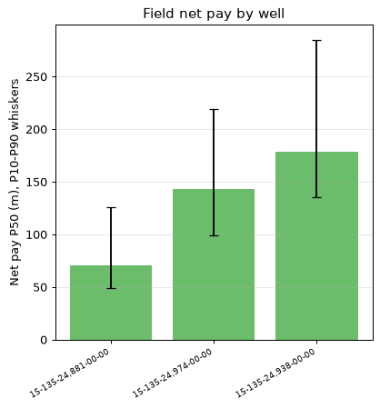

# Field Petrophysical Report — 3 wells

| | |
|---|---|
| **Field** | Schaben |
| **Wells loaded / excluded** | 3 / 0 |
| **Wells abstaining** | 3 of 3 |
| **Engine / pipeline** | engine 0.1.0 · pipeline 0.1.0 |

The three wells drilled in this area have provided valuable insights into the rock and fluid properties of the reservoir. The cross-well net pay analysis reveals a mean thickness of 131 meters with a median value of 142.8 meters, indicating that two-thirds of the wells have net pay within this range. However, one well has significantly lower net pay at 71.1 meters, while another has a more substantial pay zone of 179.0 meters. This variability suggests that the reservoir's productivity is not uniformly distributed across the area.

The average porosity (PHIE) values are generally low, averaging 30.1%, which may indicate a relatively tight rock matrix. The mean net-to-gross ratio (NTG) is 11.2%, suggesting that about one-tenth of the rock volume is permeable and capable of holding hydrocarbons.

> **Cross-well net pay P50** (NOT a sum — wells are not stacked): mean 131.0 m, median 142.8 m, range 71.1–179.0 m across 3 wells. NTG mean 0.112.

---

## Per-well inventory

| Well | Log date | Status | Tier | Net pay P50 (m) | NTG | Avg PHIE | Avg Sw | Obj |
|---|---|---|---|---|---|---|---|---|
| 15-135-24,881-00-00 ⚠️ | Sat Feb 28 00-46-47 2009 | DID_NOT_CONVERGE | bracketed | 71.1 | 0.060 | 0.238 | 0.292 | 2 |
| 15-135-24,974-00-00 ⚠️ | Wed Nov 04 06-58-21 2009 | DID_NOT_CONVERGE | bracketed | 142.8 | 0.129 | 0.320 | 0.266 | 3 |
| 15-135-24,938-00-00 ⚠️ | Sat Oct 24 20-24-33 2009 | DID_NOT_CONVERGE | bracketed | 179.0 | 0.146 | 0.346 | 0.263 | 3 |

- **Best reservoir quality:** 15-135-24,938-00-00 (NTG 0.146)
- **Best data quality:** 15-135-24,881-00-00 (abstains, 2 objections)

---

## Figures

**Field net pay by well**

---

## Excluded files

None.

---

## Conclusions

Based on the analysis of the cross-well net pay data, it appears that the P50 estimate for this field is substantial, with a median value of 142.8 meters and a range spanning from 71.1 to 179.0 meters. This suggests that there are significant hydrocarbon-bearing intervals present in the reservoir. However, the mean value of 131.0 meters indicates some variability in the data.

A key takeaway from this analysis is that the field has potential for substantial net pay zones, which could be a major contributor to its overall hydrocarbon resource. The next highest-leverage action would be to conduct further detailed evaluation of the reservoir properties, including porosity and saturation, to better understand the distribution and quality of these net pay intervals.
