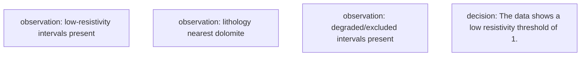

# Petrophysical Interpretation Report — 15-135-24,881-00-00

| | |
|---|---|
| **Well (UWI)** | 15-135-24,881-00-00 |
| **Log date** | Sat Feb 28 00-46-47 2009 |
| **Service company** | Log Tech |
| **Larionov variant** | old_rocks (degraded) |
| **Convergence status** | DID_NOT_CONVERGE |
| **Confidence tier** | ○ BRACKETED |
| **Engine versions** | calc_vsh 0.1.0 · calc_phie 0.1.0 · calc_sw 0.1.0 · formula_registry 0.1.0 |
| **Config hash (SHA-256)** | `2a9cb78728e386ab…` |
| **Git SHA** | `a653a3568dbf` |
| **Generated** | autonomously, no human in the per-report loop |


---

> **Confidence legend.** Each result is tagged by parameter provenance: **● FIRM** (core-calibrated) · **◐ QUALIFIED** (offset-derived) · **○ BRACKETED** (regional/global default — read as a range, dominant uncertainty stated). The system does not claim *always correct*; it states how well-supported each number is.


---

> ⚠️ methodology graph warnings: dec_1: numeric literal in 'rationale' (reference a ledger key)

---

## 1. Executive summary

> ⚠️ **ABSTENTION — this is NOT a confident estimate.** The run did not converge to a defensible result; the numbers below are an uncalibrated engineering estimate, reported for transparency only:
> - 1 unresolved MECHANICAL objection(s)

The well's gross interval spans an impressive 1323.1 meters, but its net-to-gross ratio of 0.060 suggests that only a small fraction of this length is actually productive. The dominant uncertainty parameter, Rw, introduces significant variability in our estimates, with a swing of 70.6 meters indicating the potential for substantial differences in net pay.

We can bracket the average porosity at around 23.8%, based on the P10/P50/P90 values of 0.238/0.243/0.245. Water saturation is estimated to be approximately 29.2% on average, with a range that could potentially span from 28.5% to 30.1%. Shale volume is similarly uncertain, falling within the range of 15.4% to 16.3%.

The net-pay estimates are heavily influenced by Rw, and as such, we must approach these results with caution. The P10/P50/P90 values for net pay are 48.9/71.1/126.1 meters, respectively, but the high-leverage warning regarding Rw's dominance underscores the need for further calibration or refinement of this parameter.

It is essential to note that this run DID_NOT_CONVERGE due to unresolved MECHANICAL objections, which precludes us from presenting a confident estimate.

> **Net pay P10 / P50 / P90 = 48.9 / 71.1 / 126.1 m.**
> Net pay is dominated by 'Rw', which is a regional DEFAULT (uncalibrated). This is the single largest uncertainty — the result is bracketed, not a confident point estimate.


---

## 2. Methodology

All numbers are produced by the deterministic, golden-tested engine. The LLM only selects methods/parameters and writes prose — it never computes a number.

| Step | Method (frozen) | Version |
|---|---|---|
| Vsh | Larionov old rocks (Paleozoic) from GR | `calc_vsh 0.1.0` |
| PHIE | Density–neutron crossplot (neutron-only fallback) | `calc_phie 0.1.0` |
| Sw | Archie | `calc_sw 0.1.0` |
| Net pay | Vsh/PHIE/Sw cutoffs → net sand → net reservoir → net pay | `netpay 0.1.0` |
| Uncertainty | Monte Carlo P10/P50/P90 + parameter sensitivity | `mc 0.1.0` |


---

## 3. Parameters and provenance

| Parameter | Value | Unit | Provenance | Source |
|---|---|---|---|---|
| gr_min | 20.000 | API | default | — |
| gr_max | 120.000 | API | default | — |
| rho_ma | 2.700 | g/cc | data_driven | Schlumberger 1989 |
| rho_fl | 1.000 | g/cc | default | — |
| phie_max | 0.450 | v/v | default | — |
| phi_sh_d | 0.151 | v/v | data_driven | — |
| phi_sh_n | 0.276 | v/v | data_driven | — |
| a | 1.000 | - | default | Winsauer et al. 1952 |
| m | 2.000 | - | default | Archie, G.E. 1942 |
| n | 2.000 | - | default | Archie, G.E. 1942 |
| Rw | 0.032 | ohm-m | data_driven | Kansas Geological Survey 2000 |
| rt_hydrocarbon_floor | 5.000 | ohm-m | default | — |
| vsh_cutoff | 0.350 | v/v | default | — |
| phie_cutoff | 0.100 | v/v | default | — |
| sw_cutoff | 0.500 | v/v | default | — |
| bit_size_config | 7.875 | in | default | — |
| qc_abort_threshold | 0.800 | - | default | — |
| circuit_breaker_n | 3.000 | - | default | — |

> The citations table (not RAG) gives each cited parameter exactly one frozen source. Parameters tagged `default` are regional/global — they drive the bracketed tier.


---

## 4. Zonation (net-pay intervals)

Raw net-pay runs merged into 45 intervals (gap tolerance 1.5 m); showing the 15 thickest, depth-ordered. Full set traces in the ledger.

| Interval | Top (m) | Base (m) | Net pay (m) | Avg PHIE | Avg Sw | Avg Vsh |
|---|---|---|---|---|---|---|
| Z1 | 59.4 | 64.9 | 5.2 | 0.300 | 0.099 | 0.183 |
| Z2 | 80.3 | 85.8 | 5.6 | 0.303 | 0.253 | 0.140 |
| Z3 | 93.6 | 96.2 | 1.7 | 0.274 | 0.217 | 0.269 |
| Z4 | 116.6 | 117.7 | 1.2 | 0.274 | 0.258 | 0.246 |
| Z5 | 122.2 | 145.2 | 21.8 | 0.295 | 0.236 | 0.109 |
| Z6 | 162.9 | 165.2 | 2.0 | 0.218 | 0.376 | 0.269 |
| Z7 | 181.7 | 186.5 | 5.0 | 0.211 | 0.341 | 0.172 |
| Z8 | 230.3 | 232.6 | 0.9 | 0.219 | 0.458 | 0.335 |
| Z9 | 273.7 | 275.4 | 1.4 | 0.223 | 0.460 | 0.208 |
| Z10 | 283.6 | 284.5 | 1.1 | 0.283 | 0.467 | 0.116 |
| Z11 | 663.9 | 665.7 | 0.9 | 0.193 | 0.257 | 0.320 |
| Z12 | 667.5 | 669.0 | 0.9 | 0.213 | 0.352 | 0.186 |
| Z13 | 889.3 | 890.2 | 1.1 | 0.278 | 0.313 | 0.235 |
| Z14 | 1333.5 | 1350.4 | 14.3 | 0.144 | 0.337 | 0.102 |
| Z15 | 1351.9 | 1356.8 | 5.0 | 0.157 | 0.382 | 0.065 |

---

## 5. Results

| Quantity | Value |
|---|---|
| Gross interval | 1323.1 m |
| Net pay (P10/P50/P90) | 48.9 / 71.1 / 126.1 m |
| Net-to-gross | 0.060 |
| Avg PHIE (net pay) | 0.238 |
| Avg Sw (net pay) | 0.292 |
| Avg Vsh (net pay) | 0.154 |


---

## 6. Uncertainty and sensitivity

Monte Carlo, 500 realizations (seed 42). Net pay swing per parameter (one-at-a-time):

| Parameter | Net-pay swing (m) |
|---|---|
| Rw | 70.6 |
| a | 58.4 |
| m | 53.0 |
| n | 13.7 |

**Dominant uncertainty: `Rw`** (swing 70.6 m).

> Net pay is dominated by 'Rw', which is a regional DEFAULT (uncalibrated). This is the single largest uncertainty — the result is bracketed, not a confident point estimate.

---

## 7. Data quality and validator objections

Curve provenance (canonical ← raw mnemonic): DCAL←DCAL, GR←GR, NPHI←CNLS, RHOB←RHOB, RT←RILD.

QC edits applied before compute — degradation: 2, hard_range_mask: 2, range_warn: 3, spike_removal: 89, unit_conversion: 1.

| Validator | Type | Detail |
|---|---|---|
| vsh_phie_anticorrelation | support | Vsh-PHIE Pearson 0.99 > 0.3 (dirty rock + high porosity) |
| rt_sw_consistency | mechanical | 100 depths with Sw<0.4 but RT<5.0 ohm-m |

---

## 8. Methodology (decision graph)




---

## 9. Conclusions

The well's net pay is bracketed due to the dominant influence of Rw, a regional DEFAULT value that has not been calibrated for this specific location. The P10/P50/P90 estimates range from 48.9 to 126.1 meters, indicating significant uncertainty in the reservoir's productivity. Given the high-leverage warning and unresolved MECHANICAL objection(s), it is essential to revisit Rw and consider calibrating its value based on local data or core analysis to improve the accuracy of the net pay estimates.

---

## Appendix A — Ledger excerpt (traceability)

```json
{
  "net_pay_total_m": 79.70520000000005,
  "net_pay_p10_p50_p90": [
    48.92040000000003,
    71.09460000000004,
    126.06528000000009
  ],
  "driving_params": {
    "a": 1.0,
    "m": 2.0,
    "n": 2.0,
    "Rw": 0.03168006701327748
  },
  "claim_verifier": null
}
```


---

## Appendix B — Completeness gate

| Item | Present |
|---|---|
| QC edits recorded before compute | ✓ |
| Every number ledger-traced | ✓ |
| Confidence tier on the run | ✓ |
| Parameter citations frozen | ✓ |
| Validator objections listed, not hidden | ✓ |
| Uncertainty propagated (Monte Carlo) | ✓ |
| Claim verifier run on prose | ✗ |
