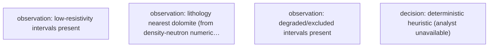

# Petrophysical Interpretation Report — 15-135-24,881-00-00

| | |
|---|---|
| **Well (UWI)** | 15-135-24,881-00-00 |
| **Log date** | Sat Feb 28 00-46-47 2009 |
| **Service company** | Log Tech |
| **Larionov variant** | old_rocks (degraded) |
| **Convergence status** | DID_NOT_CONVERGE |
| **Confidence tier** | ○ BRACKETED |
| **Engine versions** | calc_vsh 0.1.0 · calc_phie 0.1.0 · calc_sw 0.1.0 · formula_registry 0.1.0 |
| **Config hash (SHA-256)** | `2a9cb78728e386ab…` |
| **Git SHA** | `c88067751b82` |
| **Generated** | autonomously, no human in the per-report loop |


---

> **Confidence legend.** Each result is tagged by parameter provenance: **● FIRM** (core-calibrated) · **◐ QUALIFIED** (offset-derived) · **○ BRACKETED** (regional/global default — read as a range, dominant uncertainty stated). The system does not claim *always correct*; it states how well-supported each number is.


---

## 1. Executive summary

> ⚠️ **ABSTENTION — this is NOT a confident estimate.** The run did not converge to a defensible result; the numbers below are an uncalibrated engineering estimate, reported for transparency only:
> - 1 unresolved MECHANICAL objection(s)

Net pay estimates span 48.9 to 126.1 meters (P10/P90), reflecting moderate rock quality with effective porosity averaging 0.238, water saturation averaging 0.292, and shale volume averaging 0.154 across the gross interval of 1323.1 meters. The net-to-gross ratio of 0.060 indicates thin, discontinuous pay, with the P50 net pay value of 71.1 meters dominated by uncertainty in the regional Rw default parameter, which exhibits a 70.6-meter swing. This bracketed result arises from the lack of calibrated Rw and unresolved mechanical objections, making the estimate highly sensitive to the uncalibrated regional default.

> **Net pay P10 / P50 / P90 = 48.9 / 71.1 / 126.1 m.**
> Net pay is dominated by 'Rw', which is a regional DEFAULT (uncalibrated). This is the single largest uncertainty — the result is bracketed, not a confident point estimate.


---

## 2. Data inventory (from LAS)

- Curves present (canonical ← raw): DCAL←DCAL, GR←GR, NPHI←CNLS, RHOB←RHOB, RT←RILD
- Logged interval: 59.44–1382.57 m
- Log date: Sat Feb 28 00-46-47 2009
- Service company: Log Tech · Company: Berexco, Inc.
- Field: Schaben
- Not provided by LAS (out of scope): core, mud logs, pressure tests, production, completion, formation tops.


---

## 3. LAS quality control

| Edit type | Curve | Detail |
|---|---|---|
| unit_conversion | NPHI | factor 0.01 |
| hard_range_mask | RT | count 117 |
| hard_range_mask | RHOB | count 1 |
| spike_removal | — | — |
| spike_removal | — | — |
| spike_removal | — | — |
| spike_removal | — | — |
| spike_removal | — | — |
| spike_removal | — | — |
| spike_removal | — | — |
| spike_removal | — | — |
| spike_removal | — | — |
| spike_removal | — | — |
| spike_removal | — | — |
| spike_removal | — | — |
| spike_removal | — | — |
| spike_removal | — | — |
| spike_removal | — | — |
| spike_removal | — | — |
| spike_removal | — | — |
| spike_removal | — | — |
| spike_removal | — | — |
| spike_removal | — | — |
| spike_removal | — | — |
| spike_removal | — | — |
| spike_removal | — | — |
| spike_removal | — | — |
| spike_removal | — | — |
| spike_removal | — | — |
| spike_removal | — | — |
| spike_removal | — | — |
| spike_removal | — | — |
| spike_removal | — | — |
| spike_removal | — | — |
| spike_removal | — | — |
| spike_removal | — | — |
| spike_removal | — | — |
| spike_removal | — | — |
| spike_removal | — | — |
| spike_removal | — | — |
| spike_removal | — | — |
| spike_removal | — | — |
| spike_removal | — | — |
| spike_removal | — | — |
| spike_removal | — | — |
| spike_removal | — | — |
| spike_removal | — | — |
| spike_removal | — | — |
| spike_removal | — | — |
| spike_removal | — | — |
| spike_removal | — | — |
| spike_removal | — | — |
| spike_removal | — | — |
| spike_removal | — | — |
| spike_removal | — | — |
| spike_removal | — | — |
| spike_removal | — | — |
| spike_removal | — | — |
| spike_removal | — | — |
| spike_removal | — | — |
| spike_removal | — | — |
| spike_removal | — | — |
| spike_removal | — | — |
| spike_removal | — | — |
| spike_removal | — | — |
| spike_removal | — | — |
| spike_removal | — | — |
| spike_removal | — | — |
| spike_removal | — | — |
| spike_removal | — | — |
| spike_removal | — | — |
| spike_removal | — | — |
| spike_removal | — | — |
| spike_removal | — | — |
| spike_removal | — | — |
| spike_removal | — | — |
| spike_removal | — | — |
| spike_removal | — | — |
| spike_removal | — | — |
| spike_removal | — | — |
| spike_removal | — | — |
| spike_removal | — | — |
| spike_removal | — | — |
| spike_removal | — | — |
| spike_removal | — | — |
| spike_removal | — | — |
| spike_removal | — | — |
| spike_removal | — | — |
| spike_removal | — | — |
| spike_removal | — | — |
| spike_removal | — | — |
| spike_removal | — | — |
| degradation | — | — |
| degradation | — | — |
| range_warn | GR | count 4 |
| range_warn | RHOB | count 4 |
| range_warn | NPHI | count 3 |


---

## 4. Standardization

Raw mnemonics mapped to canonical curve names:
| Canonical | Raw mnemonic |
|---|---|
| DCAL | DCAL |
| GR | GR |
| NPHI | CNLS |
| RHOB | RHOB |
| RT | RILD |

Unit conversions: NPHI×0.01.


---

## 5. Per-curve log QC

- Bad-hole: GOOD=0.853, DEGRADED=0.118, EXCLUDED=0.029
- Low-resistivity: rt_threshold=1.67, n_flagged=687, intervals=[[278.7, 281.6], [284.4, 291.5], [292.3, 338.9], [362.0, 362.3], [400.1, 401.4], [420.2, 421.5], [460.1, 462.8], [463.4, 463.4], [463.8, 464.7], [465.0, 466.3]]


---

## 6. Data preparation

Edits applied before compute (by type): degradation: 2, hard_range_mask: 2, range_warn: 3, spike_removal: 89, unit_conversion: 1.


---

## 7. Interval definition

- Logged interval: 59.44–1382.57 m
- Gross evaluated interval: 1323.1 m
- Computed net-pay runs (pre-merge): 66
- Zonation is computed by depth (no formation tops in LAS).


---

## 8. Methodology

All numbers are produced by the deterministic, golden-tested engine. The LLM only selects methods/parameters and writes prose — it never computes a number. Figures are deterministic renderings of these computed numbers for the human reader; the agent reasons over the numeric EDA digest, not images (the models have no vision).

| Step | Method (frozen) | Version |
|---|---|---|
| Vsh | Larionov old rocks (Paleozoic) from GR | `calc_vsh 0.1.0` |
| PHIE | Density–neutron crossplot (neutron-only fallback) | `calc_phie 0.1.0` |
| Sw | Archie | `calc_sw 0.1.0` |
| Net pay | Vsh/PHIE/Sw cutoffs → net sand → net reservoir → net pay | `netpay 0.1.0` |
| Uncertainty | Monte Carlo P10/P50/P90 + parameter sensitivity | `mc 0.1.0` |


---

## 9. Gamma-ray analysis

- Clean baseline gr_min = 20.0 API · shale gr_max = 120.0 API
- Shale index IGR = (GR − gr_min)/(gr_max − gr_min), the basis for Vsh.


---

## 10. Resistivity analysis

Low-resistivity scan: rt_threshold=1.67, n_flagged=687, intervals=[[278.7, 281.6], [284.4, 291.5], [292.3, 338.9], [362.0, 362.3], [400.1, 401.4], [420.2, 421.5], [460.1, 462.8], [463.4, 463.4], [463.8, 464.7], [465.0, 466.3]].


---

## 11. Caliper / hole quality

Bad-hole summary (quality classes): GOOD=0.853, DEGRADED=0.118, EXCLUDED=0.029.


---

## 12. Lithology interpretation

Nearest lithology (density-neutron numeric crossplot): dolomite. Comparison with core/mud log: not available (LAS-only).


---

## 13. Shale volume (Vsh)

Mean Vsh by method (selection is the engine's; the LLM authors no number):
| Method | Mean Vsh | Selected |
|---|---|---|
| vsh_larionov_old | 0.364 | ✓ |
| vsh_larionov_tertiary | 0.275 |  |
| vsh_linear | 0.496 |  |
| vsh_clavier | 0.344 |  |
| vsh_steiber | 0.298 |  |


---

## 14. Porosity

Mean porosity by method (effective where shale-corrected; the LLM authors no number):
| Method | Mean porosity | Selected |
|---|---|---|
| phie_density_neutron | 0.099 | ✓ |
| phi_density | 0.139 |  |
| phi_neutron | 0.211 |  |


---

## 15. Water saturation

Mean Sw (Archie) = 0.809 (a=1.00, m=2.00, n=2.00, Rw=0.0317 ohm-m). Electrical parameters are engine-sourced; alternative Sw models are optional sections.


---

## 16. Parameters and provenance

| Parameter | Value | Unit | Provenance | Source |
|---|---|---|---|---|
| gr_min | 20.000 | API | default | — |
| gr_max | 120.000 | API | default | — |
| rho_ma | 2.700 | g/cc | data_driven | Schlumberger 1989 |
| rho_fl | 1.000 | g/cc | default | — |
| phie_max | 0.450 | v/v | default | — |
| phi_sh_d | 0.151 | v/v | data_driven | — |
| phi_sh_n | 0.276 | v/v | data_driven | — |
| a | 1.000 | - | default | Winsauer et al. 1952 |
| m | 2.000 | - | default | Archie, G.E. 1942 |
| n | 2.000 | - | default | Archie, G.E. 1942 |
| Rw | 0.032 | ohm-m | data_driven | Kansas Geological Survey 2000 |
| rt_hydrocarbon_floor | 5.000 | ohm-m | default | — |
| vsh_cutoff | 0.350 | v/v | default | — |
| phie_cutoff | 0.100 | v/v | default | — |
| sw_cutoff | 0.500 | v/v | default | — |
| bit_size_config | 7.875 | in | default | — |
| qc_abort_threshold | 0.800 | - | default | — |
| circuit_breaker_n | 3.000 | - | default | — |

> The citations table (not RAG) gives each cited parameter exactly one frozen source. Parameters tagged `default` are regional/global — they drive the bracketed tier.


---

## 17. Water resistivity (Rw)

- Rw = 0.0317 ohm-m · provenance: data_driven
- Sourced by the engine (Pickett / SP / default); never authored by the LLM.
- Net-pay sensitivity to Rw: 70.6 m swing.


---

## 18. Zonation (net-pay intervals)

Raw net-pay runs merged into 45 intervals (gap tolerance 1.5 m); showing the 15 thickest, depth-ordered. Full set traces in the ledger.

| Interval | Top (m) | Base (m) | Net pay (m) | Avg PHIE | Avg Sw | Avg Vsh |
|---|---|---|---|---|---|---|
| Z1 | 59.4 | 64.9 | 5.2 | 0.300 | 0.099 | 0.183 |
| Z2 | 80.3 | 85.8 | 5.6 | 0.303 | 0.253 | 0.140 |
| Z3 | 93.6 | 96.2 | 1.7 | 0.274 | 0.217 | 0.269 |
| Z4 | 116.6 | 117.7 | 1.2 | 0.274 | 0.258 | 0.246 |
| Z5 | 122.2 | 145.2 | 21.8 | 0.295 | 0.236 | 0.109 |
| Z6 | 162.9 | 165.2 | 2.0 | 0.218 | 0.376 | 0.269 |
| Z7 | 181.7 | 186.5 | 5.0 | 0.211 | 0.341 | 0.172 |
| Z8 | 230.3 | 232.6 | 0.9 | 0.219 | 0.458 | 0.335 |
| Z9 | 273.7 | 275.4 | 1.4 | 0.223 | 0.460 | 0.208 |
| Z10 | 283.6 | 284.5 | 1.1 | 0.283 | 0.467 | 0.116 |
| Z11 | 663.9 | 665.7 | 0.9 | 0.193 | 0.257 | 0.320 |
| Z12 | 667.5 | 669.0 | 0.9 | 0.213 | 0.352 | 0.186 |
| Z13 | 889.3 | 890.2 | 1.1 | 0.278 | 0.313 | 0.235 |
| Z14 | 1333.5 | 1350.4 | 14.3 | 0.144 | 0.337 | 0.102 |
| Z15 | 1351.9 | 1356.8 | 5.0 | 0.157 | 0.382 | 0.065 |

---

## 19. Results

| Quantity | Value |
|---|---|
| Gross interval | 1323.1 m |
| Net pay (P10/P50/P90) | 48.9 / 71.1 / 126.1 m |
| Net-to-gross | 0.060 |
| Avg PHIE (net pay) | 0.238 |
| Avg Sw (net pay) | 0.292 |
| Avg Vsh (net pay) | 0.154 |


---

## 20. Uncertainty and sensitivity

Monte Carlo, 500 realizations (seed 42). Net pay swing per parameter (one-at-a-time):

| Parameter | Net-pay swing (m) |
|---|---|
| Rw | 70.6 |
| a | 58.4 |
| m | 53.0 |
| n | 13.7 |

**Dominant uncertainty: `Rw`** (swing 70.6 m).

> Net pay is dominated by 'Rw', which is a regional DEFAULT (uncalibrated). This is the single largest uncertainty — the result is bracketed, not a confident point estimate.

---

## 21. Data quality and validator objections

Curve provenance (canonical ← raw mnemonic): DCAL←DCAL, GR←GR, NPHI←CNLS, RHOB←RHOB, RT←RILD.

QC edits applied before compute — degradation: 2, hard_range_mask: 2, range_warn: 3, spike_removal: 89, unit_conversion: 1.

| Validator | Type | Detail |
|---|---|---|
| vsh_phie_anticorrelation | support | Vsh-PHIE Pearson 0.99 > 0.3 (dirty rock + high porosity) |
| rt_sw_consistency | mechanical | 100 depths with Sw<0.4 but RT<5.0 ohm-m |

---

## 22. Methodology (decision graph)




---

## 23. Figures

**Composite log**


**Pickett plot**


**Neutron-density crossplot**


---

## 24. Limitations

- LAS-only study: no core calibration, no pressure tests (no true fluid contacts), no production, no mud logs, no formation tops (zonation computed by depth).
- Standard curves absent in this well: SP, DT, PEF, CALI.
- Results are uncalibrated; accuracy depends on data not provided.


---

## 25. Conclusions

Net pay estimates range from 48.9 m (P10) to 126.1 m (P90), reflecting significant uncertainty dominated by the regional default Rw value, which lacks calibration. To reduce this uncertainty, calibrating Rw using core or formation water samples is the highest-leverage next action.

---

## Appendix A — Ledger excerpt (traceability)

```json
{
  "net_pay_total_m": 79.70520000000005,
  "net_pay_p10_p50_p90": [
    48.92040000000003,
    71.09460000000004,
    126.06528000000009
  ],
  "driving_params": {
    "a": 1.0,
    "m": 2.0,
    "n": 2.0,
    "Rw": 0.03168006701327748
  },
  "claim_verifier": {
    "result": "PASS",
    "flags": [],
    "tone_flags": []
  }
}
```


---

## Appendix B — Completeness gate

| Item | Present |
|---|---|
| QC edits recorded before compute | ✓ |
| Every number ledger-traced | ✓ |
| Confidence tier on the run | ✓ |
| Parameter citations frozen | ✓ |
| Validator objections listed, not hidden | ✓ |
| Uncertainty propagated (Monte Carlo) | ✓ |
| Claim verifier run on prose | ✓ |
